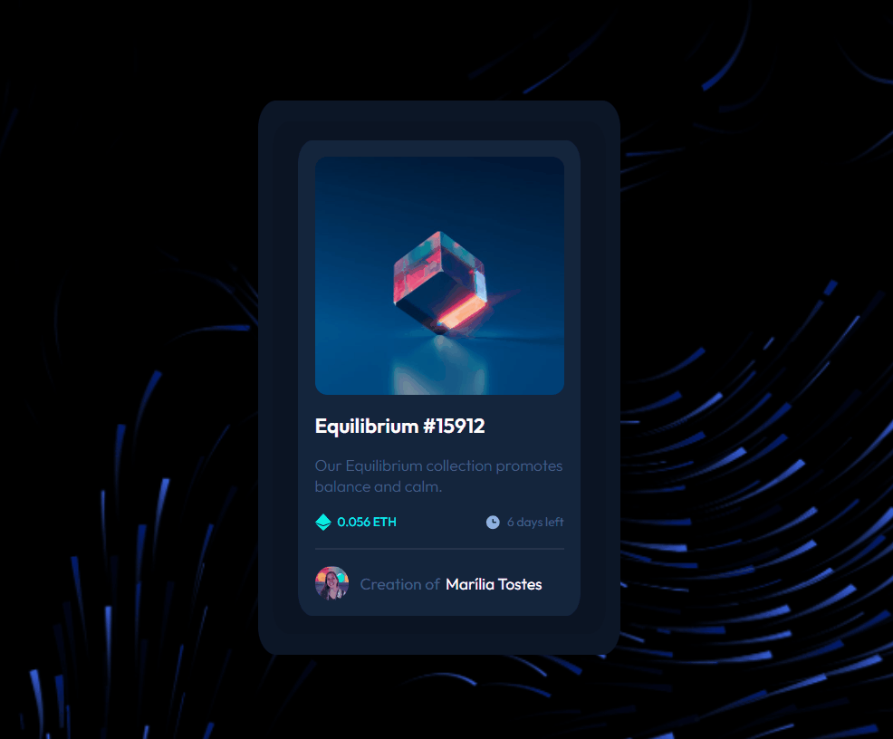

# NFT Preview Card

Este projeto é um desafio de frontend do site Frontend Mentor.  
Ele consiste em um componente de cartão de visualização para NFTs (Tokens Não Fungíveis). O cartão exibe informações sobre a obra de arte, como título, descrição, métricas (preço em ETH e tempo restante), e detalhes sobre o autor.

## Visualização:

## Estrutura HTML

A estrutura HTML utiliza tags semânticas para organizar o conteúdo, como `
`, `<section>`, `<h1>`, `<h2>`, ``, e `
`. Cada elemento é estilizado para criar o layout do cartão de visualização.

## Estilo

### Fontes

O projeto utiliza a fonte "Outfit" do Google Fonts para obter um estilo moderno e legível.

### Cores e Espaçamento

As cores são escolhidas para criar um visual atraente, com diferentes tons de azul e branco. O espaçamento é cuidadosamente ajustado para proporcionar uma experiência visual equilibrada.

### Design Responsivo

O design é responsivo, adaptando-se a diferentes tamanhos de tela para garantir uma experiência consistente em dispositivos variados.

### Efeitos de Hover

O cartão inclui efeitos de hover para tornar a interação mais dinâmica. Ao passar o mouse sobre a imagem, uma sobreposição colorida e um ícone de visualização são exibidos.

## Contato

- **Email:** mahtostes.dev@gmail.com
- **LinkedIn:** [LinkedIn - Marília Ribeiro Tostes](https://www.linkedin.com/in/marilia-ribeiro-tostes/)
- **Whatsapp:** [Fale comigo!](https://wa.me/5567981443147)
